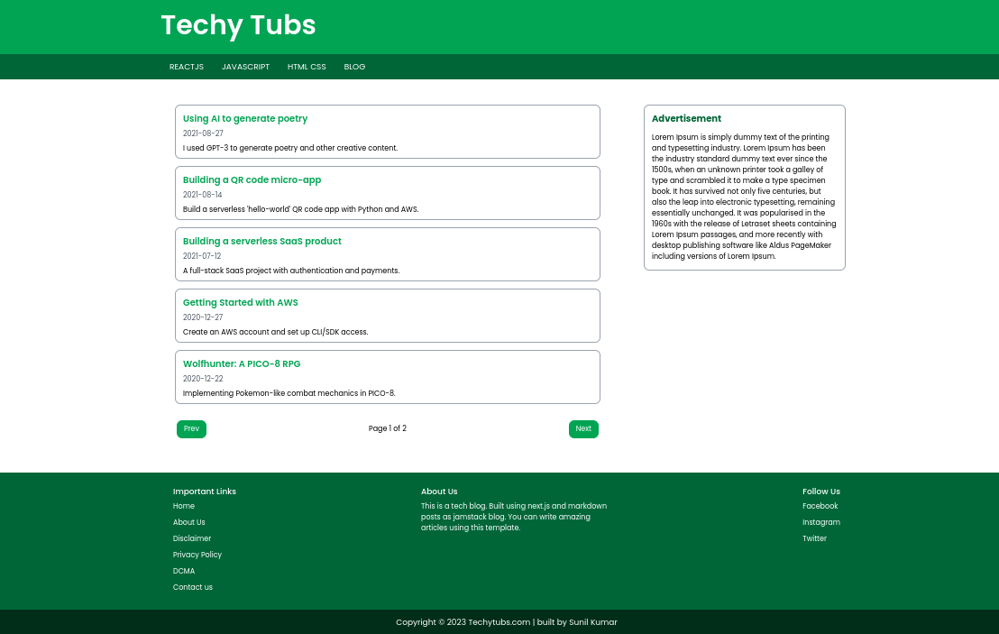
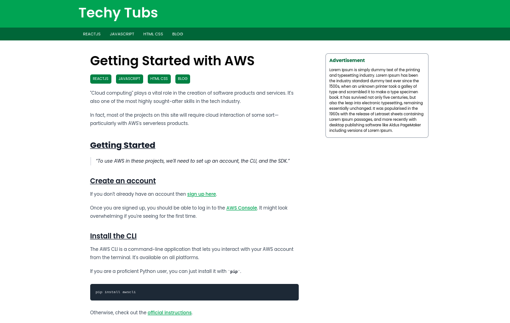
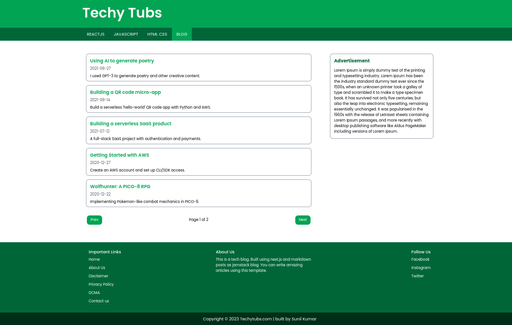
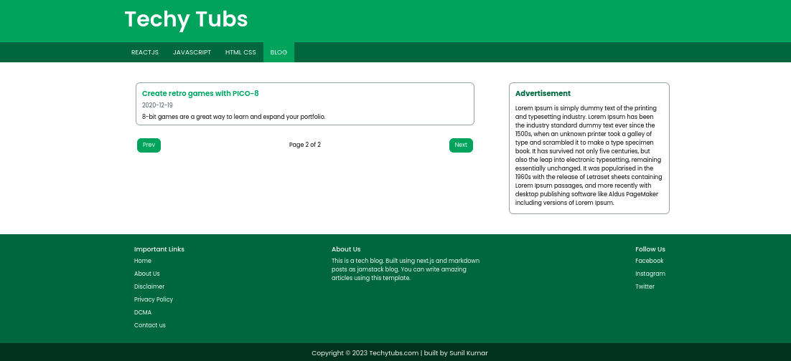

# Next.Js Markdown Blog (SSG)


## About

This is static blog created using static site generation (SSG) in Next.js. This blog has features like pagination, auto create categories, static html export.

## Packages  Used

- Next.js
- Node.js
- Tailwind
- Typescript
- GrayMatter
- Markdown-to-jsx

## Getting Started

### Set Environment Variables

``` 
HomePage_Title=Techy Tubs
HomePage_Description=Techy Tubs is tech blog website.
blogUrl=Techytubs.com
postperpage=5
```

### Install dependencies command

```bash
npm install
```

### To build the static export of the blog

```bash
npm run build
```

### For the development server

```bash
npm run dev
```

### Paths for blog articles.

```
src
|
|----posts  //for adding markdown posts
|----blogPages  //for adding pages as markdown
|
public
|
|----uploads //uploading pictures for markdown posts and pages
```

### Fields for Markdown Posts and Pages

```
  title: Mandatory  // "This is a big title"
  subtitle: Optional  // "This is a smol title"
  date: Mandatory  // "2023-05-7"
  categories: Mandatory  // ["my cat", "your cat", "our cat", "none of us cat"]
  description: Mandatory  // "This is a very important description"
```

 

## Screenshots

### Homepage



### Post Page



### Category Page



### Pagination


